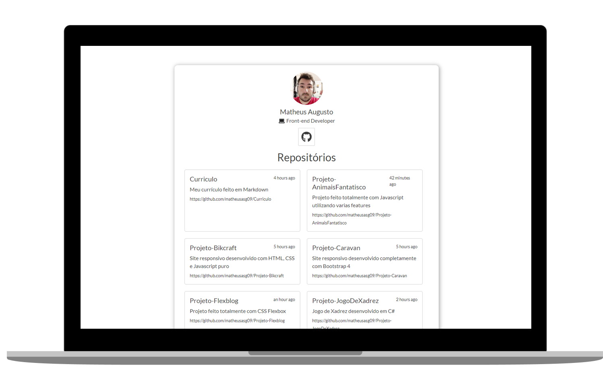

<h1 align="center">
  GITHUB API
</h1>

   
  
  
  

  

  

## ◾ Projeto

Este projeto foi feito consumindo a API do GitHub.

## ◾ Tecnologias

Esse projeto foi desenvolvido com as seguintes tecnologias:

- [HTML](https://developer.mozilla.org/pt-BR/docs/Web/HTML)
- [CSS](https://developer.mozilla.org/pt-BR/docs/Web/CSS)
- [JAVASCRIPT](https://developer.mozilla.org/pt-BR/docs/Web/JavaScript)

## ◾ Licença

Esse projeto está sob a licença MIT.
